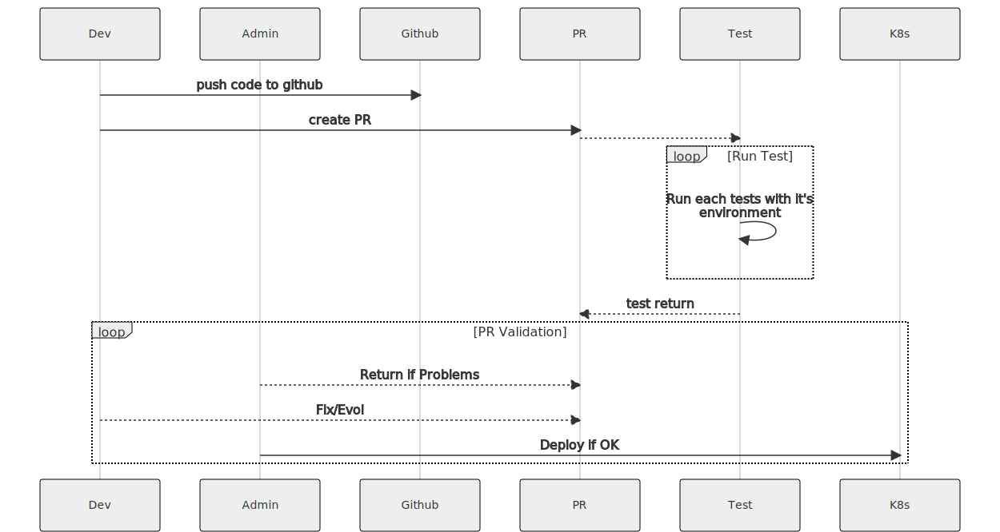

# Architecture LeadJet
## Fonctionnement
Architecture sur Kubernetes pour gérer le PCA/PRA 
* possibilité de micro service avec autant de pod que de points d'entrées pour éviter :
	* les developpements monolithique
	* facilité les retours en arrière
* ou déploiement standard : une appli entière sur plusieurs pod en loadbalancing
* pour la gestion des données, du graphql pour réduire les besoins en services spécifique pour les fonctionnalités CRUD (possible sur mongodb).
* Développement en DDD : Création et organisation du projet en entités fonctionnelles.

## Test et Déploiement
Utilisation des outils de CI de github (ou gitlab), pour effectuer des tests au PR, pour ensuite déployer ou en qualify ou en prod.

* Méthodologie TDD : Développement de tests pour chaque points d'entrées, pour vérifier des cas d'erreurs/régresssions.

